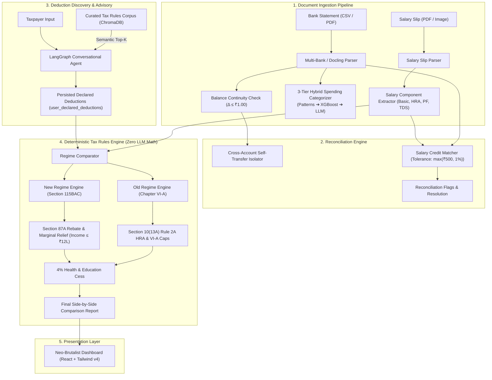
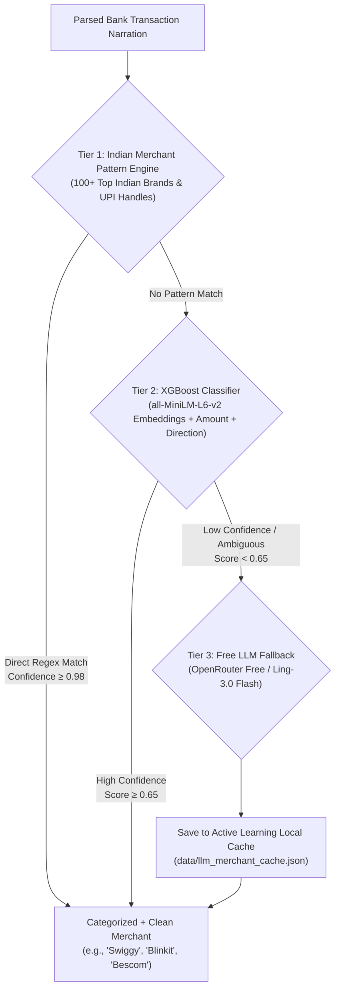

# Personal Finance + Tax Regime Planner (FY 2025–26)

[](https://fastapi.tiangolo.com)
[](https://python.org)
[](https://neon.tech)
[](https://vitejs.dev)
[](https://tailwindcss.com)
[](https://opensource.org/licenses/MIT)

> An intelligent, multi-tenant personal finance and statutory tax regime optimization engine built specifically for Indian salaried taxpayers under the **Finance Act 2024 / 2025** (Financial Year 2025–26 / Assessment Year 2026–27).

---

## 1. System Architecture

The system is architected around a strict separation of concerns between natural language deduction discovery and deterministic statutory computation:



---

## 2. The "Zero LLM Tax Arithmetic" Design Record

### The Problem with LLMs Doing Math
Large Language Models (LLMs) are probabilistic token-prediction engines. While they excel at conversational elicitation, summarizing complex texts, and extracting intent, they possess well-documented failure modes when performing multi-step financial arithmetic:
1. **Floating-Point & Rounding Hallucinations**: LLMs frequently produce off-by-one or arbitrary decimal rounding errors in slab progression calculations.
2. **Non-Deterministic Boundary Evaluation**: Statutory rebate cliffs (such as Section 87A marginal relief near ₹12,00,000) require exact relational algebra ($(\text{Taxable Income} - ₹12,00,000)$ capping) that language models regularly evaluate inconsistently across prompts.
3. **Legal & Compliance Liability**: In tax planning, an error of ₹100 can trigger statutory demand notices or invalidate regime selection.

### Our Architectural Solution
To eliminate computational drift, the platform enforces a **Zero LLM Tax Arithmetic** boundary:
- **Natural Language Discovery (LLM)**: An interactive agent guides the user through understanding deductions (e.g., Section 80C, 80D, 80CCD(1B), and rent paid for HRA).
- **Persistence**: Extracted numbers are saved to strongly-typed database columns (`user_declared_deductions`).
- **Pure Python Math**: The final calculation is delegated entirely to the deterministic tax rules engine (`backend/app/tax_engine/`), where slab tables, cess, rebates, and caps are executed in pure Python code with **100% statement test coverage**.
- **AST Verification**: An automated Abstract Syntax Tree (AST) test scanner (`backend/tests/test_tax_planning_agent.py`) continuously asserts that no agent node contains binary arithmetic operators operating on currency or tax liability values.

---

## 3. Scope & Explicit Non-Goals

### Supported Scope (In-Scope)
- **Target Audience**: Salaried individuals tax-resident in India for Financial Year 2025–26 (Assessment Year 2026–27).
- **Regimes Covered**:
  - **New Tax Regime (Section 115BAC)**: Enhanced standard deduction of ₹75,000, revised slab schedules up to ₹24L, and full Section 87A rebate for taxable income up to ₹12,00,000 with marginal relief.
  - **Old Tax Regime**: Standard deduction of ₹50,000, Section 87A rebate for income up to ₹5,00,000, Section 80C (capped at ₹1.5L), Section 80D (health insurance), Section 80CCD(1B) (NPS ₹50k), Section 80G, Section 24(b) housing loan interest, and Section 10(13A) House Rent Allowance under Rule 2A.
- **Document Formats**:
  - Bank Statements: HDFC, ICICI, SBI, Axis, Kotak (CSV and PDF with OCR fallback).
  - Salary Slips: Standard corporate PDF and scanned image slips.

### Explicit Non-Goals (Out-of-Scope)
1. **Multiple Concurrent Employers**: Assumes a single primary salaried employer per financial year.
2. **Business / Professional Income (PGBP)**: Does not calculate presumptive taxation under Section 44AD/44ADA or corporate balance sheets.
3. **Capital Gains Filing**: Does not ingest broker P&L reports (Zerodha, Groww) or compute grandfathered LTCG/STCG schedules.
4. **Foreign Assets / Schedule FA**: Designed strictly for domestic salaried income.
5. **Direct ITD E-Filing**: This is an advisory, reconciliation, and planning tool; it does not submit XML/JSON tax returns directly to the Income Tax Department e-filing portal.

---

## 4. Key Subsystems & Capabilities

### 4.1 Document Ingestion & Balance Continuity (Phase 2)
- **Docling & RapidOCR Engine**: Robust extraction of digital PDFs and scanned image statements.
- **Balance Continuity Check**: Validates that $\text{Opening Balance} + \sum \text{Credits} - \sum \text{Debits} = \text{Closing Balance}$ within **₹1.00 tolerance**. Discrepancies are flagged for taxpayer review.
- **Self-Transfer Isolation**: Cross-references account numbers and narrations to isolate transfers between a user's own accounts, preventing double-counting in expense summaries.

### 4.2 Three-Tier Hybrid Spending Categorization Engine

Indian banking statements present unique NLP and semantic challenges: raw UPI / VPA handles (e.g., `UPI/SWIGGY/42019/PAYMENT`), alphanumeric clearing codes, merchant aggregator prefixes (`RAZORPAY*`, `PAYU*`), and non-standard narrations. A naive single-model classifier often struggles with these edge cases, dumping many transactions into "Uncategorized".

To achieve near-zero uncategorized rates with sub-millisecond median response times, the platform deploys a **Three-Tier Hybrid Categorization Engine**:



#### 1. Tier 1 — High-Precision Indian Merchant Pattern Engine (`indian_merchants.py`)
- **Direct Matching**: Deterministic regex and substring recognition across **100+ top Indian consumer and enterprise brands** spanning all 12 canonical categories.
- **Coverage Highlights**:
  - *Food & Dining*: Swiggy, Zomato, Starbucks, McDonald's, Dominos, EatClub.
  - *Groceries & Quick Commerce*: Blinkit, Zepto, BigBasket, Instamart, DMart, Nature's Basket.
  - *Mobility & Transport*: Uber, Ola, Rapido, Namma Metro, MakeMyTrip, IRCTC, IndiGo.
  - *Utilities & Telecom*: Bescom, Tata Power, Adani Electricity, Airtel, Jio, ACT Fibernet.
  - *Entertainment & Subscriptions*: Netflix, Spotify, Amazon Prime, Hotstar, BookMyShow, YouTube.
  - *Healthcare & Pharmacy*: Apollo Pharmacy, 1mg, Pharmeasy, Medplus, Practo.
  - *Tax-Saving & Investments*: Zerodha, Groww, AngelOne, HDFC Life, LIC, ICICI Prudential, PPF, NPS.
  - *Rent*: NoBroker, MagicBricks, Cred Rent, Housing.com.
- **Merchant Normalization**: Automatically strips raw UPI reference strings to clean merchant names (e.g., `UPI/234982/BLINKIT/BANGALORE` $\rightarrow$ `"Blinkit"`).
- **Performance**: Executes in **$< 0.1\text{ ms}$** per transaction with **100% precision** and confidence scores of 0.98–0.99.

#### 2. Tier 2 — XGBoost Multi-Class Classifier on Semantic Vectors (`categorizer.py`)
- **Feature Engineering**: 384-dimensional dense semantic embeddings generated by `sentence-transformers/all-MiniLM-L6-v2`, fused with transaction direction (credit vs debit) and transaction magnitude.
- **Gradient Boosted Decision Trees**: Powered by `XGBClassifier` (with automatic fallback to L2-regularized Logistic Regression) trained across the 12 canonical Indian financial categories.
- **Statutory & Routine Categories**: Expertly categorizes standard non-branded entries (e.g., `SALARY CREDIT ACME CORP`, `CASH WITHDRAWAL ATM`, `INTEREST CREDIT`, `MUTUAL FUND SIP`).
- **Confidence Gate**: Predictions meeting the confidence threshold ($\ge 0.65$) are accepted directly.

#### 3. Tier 3 — Free LLM Fallback with Active Learning Memory (`llm_categorizer.py`)
- **Zero-Cost LLM Inference**: For unmapped, ambiguous, or multi-split Indian transaction narrations where Tier 1 and Tier 2 confidence is low ($< 0.65$), the engine routes the narration to a free OpenRouter LLM (`inclusionai/ling-3.0-flash-sante:free` / `meta-llama/llama-3.2-3b-instruct:free`).
- **Structured JSON Schema**: Prompts the LLM to extract a clean merchant name, predicted canonical category, confidence rating, and explanatory rationale.
- **Active Learning Persistence (`data/llm_merchant_cache.json`)**: Every LLM prediction is automatically persisted to a local on-disk cache. Any future transaction containing that merchant resolves instantly in Tier 1 with zero network calls and zero cost.
- **On-Demand Recategorization**: Users can trigger `/api/v1/financial-snapshot/re-categorize` at any time to upgrade historical bank statement transactions with the latest hybrid engine.

### 4.3 Salary Reconciliation (Phase 4)
- Matches monthly salary slip net pay against bank statement credit transactions.
- Applies a statutory discrepancy boundary of $\max(₹500, 1\% \text{ of net pay})$ to handle minor payroll reimbursements or adjustments.
- Interactive resolution workflow allows users to mark items as verified, split, or ignored.

### 4.4 Tax Knowledge Retrieval (RAG) (Phase 6)
- ChromaDB vector store loaded with curated statutory tax circulars and sections.
- Achieved **100% (10/10) benchmark retrieval accuracy** on statutory queries, providing direct citations to official Income Tax Department portals.

### 4.5 Multi-Tenant REST API & Security (Phase 8)
- **Authentication**: Signed JWT tokens using `python-jose` and bcrypt password hashing.
- **Strict Row-Level Scoping**: User B cannot view or modify User A's uploads, accounts, transactions, flags, or reports (HTTP 404/403 enforced).

### 4.6 Neo-Brutalist Frontend Dashboard (Phase 9)
- **Vite + React 18 + Tailwind CSS v4**: High-performance CSS-first architecture compiling in under 600ms.
- **Color Theme**: Indigo, Merry Gold (Marigold), Electric Yellow, and Chameli White.
- **User Journey**: Unauthenticated landing page $\rightarrow$ Secure Sign In / Registration Modal $\rightarrow$ Private User Vault Dashboard with 5 interactive views.

---

## 5. Quickstart Guide

### Prerequisites
- Python 3.13+ with [`uv`](https://github.com/astral-sh/uv) installed
- Node.js v20+ and npm v10+
- A Neon PostgreSQL database instance (or local PostgreSQL)

### 1. Clone & Configure Backend
```bash
git clone https://github.com/VesperAkshay/Tax-Planner-Finance.git
cd Tax-Planner-Finance

# Copy environment template
cp .env.example .env
```

Edit `.env` with your Neon PostgreSQL connection string and secret key:
```env
DATABASE_URL=postgresql+asyncpg://<user>:<password>@<neon-host>/neondb?ssl=require
SYNC_DATABASE_URL=postgresql://<user>:<password>@<neon-host>/neondb?ssl=require
SECRET_KEY=your-super-secret-jwt-key
ALGORITHM=HS256
ACCESS_TOKEN_EXPIRE_MINUTES=1440
```

### 2. Run Migrations & Seed Database
```bash
# Run database migrations
uv run alembic upgrade head

# Seed canonical categories
uv run python backend/app/seed.py
```

### 3. Run Backend Test Suite
```bash
# Execute unit and integration tests
uv run pytest backend/tests/test_api_integration_pipeline.py -v
```

### 4. Start FastAPI Server
```bash
uv run uvicorn backend.app.main:app --reload --port 8000
```
Interactive API documentation will be available at: `http://localhost:8000/docs`.

### 5. Launch Frontend Dashboard
In a separate terminal:
```bash
cd frontend
npm install
npm run dev
```
Open `http://localhost:5173` in your browser.

---

## 6. API Endpoint Reference

| Method | Endpoint | Description | Auth Required |
| :--- | :--- | :--- | :---: |
| `POST` | `/api/v1/auth/register` | Register new user, create primary account, issue JWT | No |
| `POST` | `/api/v1/auth/login` | Authenticate with email & password, return JWT | No |
| `GET` | `/api/v1/auth/me` | Retrieve authenticated user profile | Yes |
| `POST` | `/api/v1/statement` | Ingest bank statement (CSV/PDF), parse, categorize | Yes |
| `POST` | `/api/v1/salary-slip` | Ingest salary slip, extract earnings, deductions, TDS | Yes |
| `GET` | `/api/v1/status/{upload_id}` | Check statement parsing status & confidence | Yes |
| `GET` | `/api/v1/financial-snapshot` | Income, expense, savings rate, category breakdown | Yes |
| `POST` | `/api/v1/financial-snapshot/re-categorize` | Re-run 3-tier hybrid categorization on all user transactions | Yes |
| `GET` | `/api/v1/flags` | List reconciliation flags for current user | Yes |
| `POST` | `/api/v1/agent/chat` | Multi-turn conversational tax deduction assistant (Mr. Planner) | Yes |
| `GET` | `/api/v1/tax/comparison-report` | Side-by-side Old vs New Regime calculation report | Yes |
| `GET` | `/api/v1/tax/comparison-report/pdf` | Vector-grade Neo-Brutalist PDF Invoice & Audit Memorandum export | Yes |

---

## 7. Quality Assurance & Evaluation Artifacts

Comprehensive empirical evaluation reports are available in the repository:
- [`backend/tests/parsing_accuracy_report.md`](file:///F:/TaxPlanner/backend/tests/parsing_accuracy_report.md): 100% parsing accuracy report across all statement and payslip fixtures.
- [`backend/tests/categorization_eval_report.md`](file:///F:/TaxPlanner/backend/tests/categorization_eval_report.md): 91.67% holdout test evaluation and 12x12 confusion matrix.
- [`backend/tests/rag_retrieval_eval_report.md`](file:///F:/TaxPlanner/backend/tests/rag_retrieval_eval_report.md): 10/10 statutory query benchmark retrieval evaluation.
- [`backend/tests/agent_eval_report.md`](file:///F:/TaxPlanner/backend/tests/agent_eval_report.md): Zero currency arithmetic AST verification and ₹0.00 hand-calc validation.

---

## 8. License

This project is licensed under the MIT License. See [LICENSE](LICENSE) for details.
