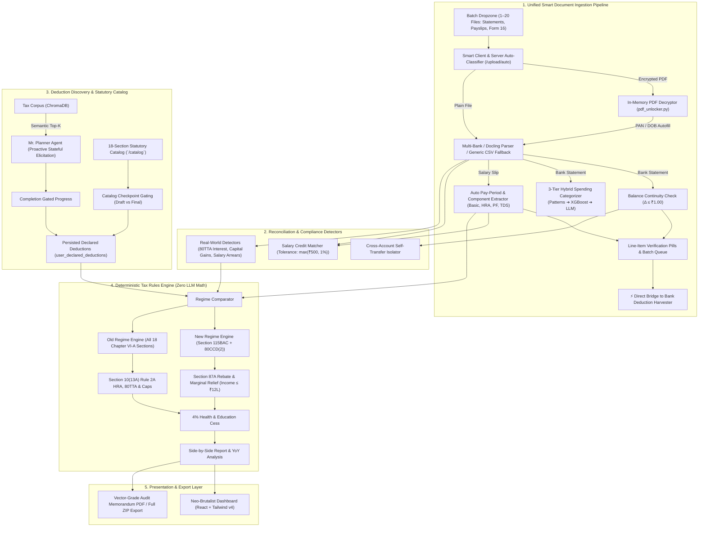
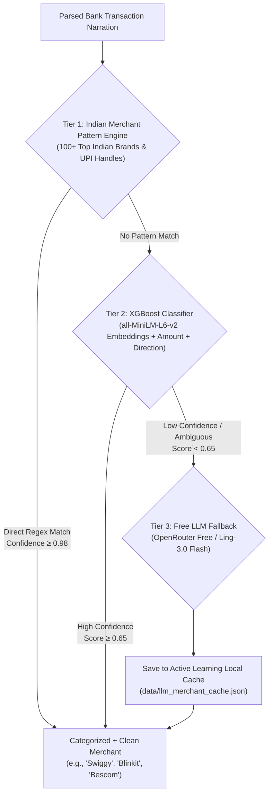

# Personal Finance + Tax Regime Planner (FY 2025–26)

[](https://fastapi.tiangolo.com)
[](https://python.org)
[](https://neon.tech)
[](https://vitejs.dev)
[](https://tailwindcss.com)
[](https://opensource.org/licenses/MIT)

> An intelligent, multi-tenant personal finance and statutory tax regime optimization engine built specifically for Indian salaried taxpayers under the **Finance Act 2024 / 2025** (Financial Year 2025–26 / Assessment Year 2026–27).

---

## 1. System Architecture

The system is architected around a strict separation of concerns between natural language deduction discovery and deterministic statutory computation:



---

## 2. The "Zero LLM Tax Arithmetic" Design Record

### The Problem with LLMs Doing Math
Large Language Models (LLMs) are probabilistic token-prediction engines. While they excel at conversational elicitation, summarizing complex texts, and extracting intent, they possess well-documented failure modes when performing multi-step financial arithmetic:
1. **Floating-Point & Rounding Hallucinations**: LLMs frequently produce off-by-one or arbitrary decimal rounding errors in slab progression calculations.
2. **Non-Deterministic Boundary Evaluation**: Statutory rebate cliffs (such as Section 87A marginal relief near ₹12,00,000) require exact relational algebra ($(\text{Taxable Income} - ₹12,00,000)$ capping) that language models regularly evaluate inconsistently across prompts.
3. **Legal & Compliance Liability**: In tax planning, an error of ₹100 can trigger statutory demand notices or invalidate regime selection.

### Our Architectural Solution
To eliminate computational drift, the platform enforces a **Zero LLM Tax Arithmetic** boundary:
- **Natural Language Discovery (LLM)**: An interactive agent guides the user through understanding deductions (e.g., Section 80C, 80D, 80CCD(1B), and rent paid for HRA).
- **Persistence**: Extracted numbers are saved to strongly-typed database columns (`user_declared_deductions`).
- **Pure Python Math**: The final calculation is delegated entirely to the deterministic tax rules engine (`backend/app/tax_engine/`), where slab tables, cess, rebates, and caps are executed in pure Python code with **100% statement test coverage**.
- **AST Verification**: An automated Abstract Syntax Tree (AST) test scanner (`backend/tests/test_tax_planning_agent.py`) continuously asserts that no agent node contains binary arithmetic operators operating on currency or tax liability values.

---

## 3. Scope & Explicit Non-Goals

### Supported Scope (In-Scope)
- **Target Audience**: Salaried individuals tax-resident in India for Financial Year 2025–26 (Assessment Year 2026–27) with multi-year historical comparison support.
- **Regimes Covered**:
  - **New Tax Regime (Section 115BAC)**: Enhanced standard deduction of ₹75,000, revised slab schedules up to ₹24L, full Section 87A rebate for taxable income up to ₹12,00,000 with marginal relief, and employer NPS under Section 80CCD(2).
  - **Old Tax Regime**: Standard deduction of ₹50,000, Section 87A rebate for income up to ₹5,00,000, and all 18 statutory Chapter VI-A sections (80C, 80CCD(1B), 80CCD(2), 80D self/family, 80D senior parents, Section 10(13A) HRA under Rule 2A, 80GG, 24(b) home loan interest, 80EEA, 80E, 80G, 80GGC, 80TTA, 80TTB, 80DD, 80DDB, 80U, and 10(5) LTA).
- **Document Formats & Ingestion**:
  - **Unified Multi-File Batch Queue**: Drag & drop 1 to 20 files simultaneously (all 12 payslips + statements at once) with automatic document type classification (`/upload/auto`).
  - **In-Memory Password Unlock**: Memory-only decryption for password-protected Indian bank statements and payslips (with one-click "Try PAN from Profile" shortcut).
  - **Bank Statements**: HDFC, ICICI, SBI, Axis, Kotak, generic standard CSVs (auto-fallback), and custom bank CSVs (with running balance delta inference), plus digital and scanned PDFs with OCR fallback.
  - **Salary Slips**: Standard corporate PDF and scanned image slips with zero-dropdown automatic month, year, and financial year detection.

### Explicit Non-Goals (Out-of-Scope)
1. **Multiple Concurrent Employers**: Assumes a single primary salaried employer per financial year.
2. **Business / Professional Income (PGBP)**: Does not calculate presumptive taxation under Section 44AD/44ADA or corporate balance sheets.
3. **Capital Gains Filing**: Informational advisory only. The system detects broker transactions / mutual fund redemptions (CAMS, Zerodha, Groww) and flags a warning that the taxpayer must file Form ITR-2; it explicitly performs **zero capital gains tax arithmetic**.
4. **Foreign Assets / Schedule FA**: Flags foreign currency / forex transactions for manual review, but does not prepare Schedule FA filings.
5. **Direct ITD E-Filing**: This is an advisory, reconciliation, and planning tool; it does not submit XML/JSON tax returns directly to the Income Tax Department e-filing portal.

---

## 4. Key Subsystems & Capabilities

### 4.1 Document Ingestion & Balance Continuity (Phase 2)
- **Docling & RapidOCR Engine**: Robust extraction of digital PDFs and scanned image statements.
- **Balance Continuity Check**: Validates that $\text{Opening Balance} + \sum \text{Credits} - \sum \text{Debits} = \text{Closing Balance}$ within **₹1.00 tolerance**. Discrepancies are flagged for taxpayer review.
- **Self-Transfer Isolation**: Cross-references account numbers and narrations to isolate transfers between a user's own accounts, preventing double-counting in expense summaries.

### 4.2 Three-Tier Hybrid Spending Categorization Engine

Indian banking statements present unique NLP and semantic challenges: raw UPI / VPA handles (e.g., `UPI/SWIGGY/42019/PAYMENT`), alphanumeric clearing codes, merchant aggregator prefixes (`RAZORPAY*`, `PAYU*`), and non-standard narrations. A naive single-model classifier often struggles with these edge cases, dumping many transactions into "Uncategorized".

To achieve near-zero uncategorized rates with sub-millisecond median response times, the platform deploys a **Three-Tier Hybrid Categorization Engine**:



#### 1. Tier 1 — High-Precision Indian Merchant Pattern Engine (`indian_merchants.py`)
- **Direct Matching**: Deterministic regex and substring recognition across **100+ top Indian consumer and enterprise brands** spanning all 12 canonical categories.
- **Coverage Highlights**:
  - *Food & Dining*: Swiggy, Zomato, Starbucks, McDonald's, Dominos, EatClub.
  - *Groceries & Quick Commerce*: Blinkit, Zepto, BigBasket, Instamart, DMart, Nature's Basket.
  - *Mobility & Transport*: Uber, Ola, Rapido, Namma Metro, MakeMyTrip, IRCTC, IndiGo.
  - *Utilities & Telecom*: Bescom, Tata Power, Adani Electricity, Airtel, Jio, ACT Fibernet.
  - *Entertainment & Subscriptions*: Netflix, Spotify, Amazon Prime, Hotstar, BookMyShow, YouTube.
  - *Healthcare & Pharmacy*: Apollo Pharmacy, 1mg, Pharmeasy, Medplus, Practo.
  - *Tax-Saving & Investments*: Zerodha, Groww, AngelOne, HDFC Life, LIC, ICICI Prudential, PPF, NPS.
  - *Rent*: NoBroker, MagicBricks, Cred Rent, Housing.com.
- **Merchant Normalization**: Automatically strips raw UPI reference strings to clean merchant names (e.g., `UPI/234982/BLINKIT/BANGALORE` $\rightarrow$ `"Blinkit"`).
- **Performance**: Executes in **$< 0.1\text{ ms}$** per transaction with **100% precision** and confidence scores of 0.98–0.99.

#### 2. Tier 2 — XGBoost Multi-Class Classifier on Semantic Vectors (`categorizer.py`)
- **Feature Engineering**: 384-dimensional dense semantic embeddings generated by `sentence-transformers/all-MiniLM-L6-v2`, fused with transaction direction (credit vs debit) and transaction magnitude.
- **Gradient Boosted Decision Trees**: Powered by `XGBClassifier` (with automatic fallback to L2-regularized Logistic Regression) trained across the 12 canonical Indian financial categories.
- **Statutory & Routine Categories**: Expertly categorizes standard non-branded entries (e.g., `SALARY CREDIT ACME CORP`, `CASH WITHDRAWAL ATM`, `INTEREST CREDIT`, `MUTUAL FUND SIP`).
- **Confidence Gate**: Predictions meeting the confidence threshold ($\ge 0.65$) are accepted directly.

#### 3. Tier 3 — Free LLM Fallback with Active Learning Memory (`llm_categorizer.py`)
- **Zero-Cost LLM Inference**: For unmapped, ambiguous, or multi-split Indian transaction narrations where Tier 1 and Tier 2 confidence is low ($< 0.65$), the engine routes the narration to a free OpenRouter LLM (`inclusionai/ling-3.0-flash-sante:free` / `meta-llama/llama-3.2-3b-instruct:free`).
- **Structured JSON Schema**: Prompts the LLM to extract a clean merchant name, predicted canonical category, confidence rating, and explanatory rationale.
- **Active Learning Persistence (`data/llm_merchant_cache.json`)**: Every LLM prediction is automatically persisted to a local on-disk cache. Any future transaction containing that merchant resolves instantly in Tier 1 with zero network calls and zero cost.
- **On-Demand Recategorization**: Users can trigger `/api/v1/financial-snapshot/re-categorize` at any time to upgrade historical bank statement transactions with the latest hybrid engine.

### 4.3 Salary Reconciliation (Phase 4)
- Matches monthly salary slip net pay against bank statement credit transactions.
- Applies a statutory discrepancy boundary of $\max(₹500, 1\% \text{ of net pay})$ to handle minor payroll reimbursements or adjustments.
- Interactive resolution workflow allows users to mark items as verified, split, or ignored.

### 4.4 Tax Knowledge Retrieval (RAG) (Phase 6)
- ChromaDB vector store loaded with curated statutory tax circulars and sections.
- Achieved **100% (10/10) benchmark retrieval accuracy** on statutory queries, providing direct citations to official Income Tax Department portals.

### 4.5 Multi-Tenant REST API & Security (Phase 8)
- **Authentication**: Signed JWT tokens using `python-jose` and bcrypt password hashing.
- **Strict Row-Level Scoping**: User B cannot view or modify User A's uploads, accounts, transactions, flags, or reports (HTTP 404/403 enforced).

### 4.6 Neo-Brutalist Frontend Dashboard (Phase 9)
- **Vite + React 18 + Tailwind CSS v4**: High-performance CSS-first architecture compiling in under 600ms.
- **Color Theme**: Indigo, Merry Gold (Marigold), Electric Yellow, and Chameli White.
- **User Journey**: Unauthenticated landing page $\rightarrow$ Secure Sign In / Registration Modal $\rightarrow$ Private User Vault Dashboard with 5 interactive views.

### 4.7 Mr. Planner & Neo-Brutalist Invoice PDF Engine (Phase 12)
- **Mr. Planner Conversational Persona**: Guided tax planning assistant backed by deterministic state guards and RAG citations.
- **Vector-Grade PDF Audit Memorandum**: Built with ReportLab 5, rendering a physical CA-grade audit invoice on Chameli cream `#FAF7F2` paper, drop-shadow offset frames, dual-regime side-by-side comparative ledger, slabs audit breakdown, AIS/26AS checklist, and official CA advisory stamps.
- **Streaming Export**: Dedicated endpoint (`GET /api/v1/tax/comparison-report/pdf`) generating downloadable, print-ready vector PDF memoranda.

### 4.8 Proactive Stateful Elicitation Engine (Phase 13)
- **Turn-by-Turn Canonical Progression**: Walks the taxpayer systematically through statutory deduction categories in priority order (80C, 80CCD(1B), 80D self/family, 80D senior parents, Section 10(13A) HRA, Section 24(b), 80G).
- **Contextual Auto-Skips**: Automatically evaluates preconditions from uploaded salary slips (e.g. automatically skips Section 80GG when employer HRA is already present in payslips).
- **Completion Gate**: Intercepts premature computation requests (e.g. *"Calculate my tax now"*) and prompts the user to resolve pending deductions first, ensuring optimization accuracy.
- **Cross-Session Resumption**: Persists state in `elicitation_progress` table, allowing taxpayers to leave and resume their deduction interview anytime.

### 4.9 Comprehensive 18-Section Statutory Deduction Catalog (Phase 14)
- **Full Statutory Coverage**: Dedicated `deduction_catalog` database repository seeded with all 18 personal tax deduction sections under Chapter VI-A & Section 10 (80C, 80CCD(1B), 80CCD(2), 80D, 80D parents, 10(13A), 80GG, 24(b), 80EEA, 80E, 80G, 80GGC, 80TTA, 80TTB, 80DD, 80DDB, 80U, 10(5) LTA).
- **Interactive Catalog API**: `GET /api/v1/catalog` exposes limits, eligibility conditions, regime applicability, and official ITD portal citations.
- **Direct Declarations**: Direct declaration endpoint (`POST /api/v1/catalog/declare`) for self-service tax input.
- **Catalog Checkpoint Gating**: Requires explicit catalog review (`POST /api/v1/catalog/viewed`); comparisons output `report_status = "draft"` until the catalog is reviewed, ensuring no deduction is overlooked before finalization.

### 4.10 Account Lifecycle, Overlap Deduplication & Right-to-Erasure (Phase 15)
- **SHA-256 Upload Deduplication**: Hashes every incoming file to reject duplicate statement uploads with HTTP 409 Conflict.
- **Overlapping Statement Deduplication**: Detects date overlaps across statements and deduplicates transactions at the row level, preventing double-counting of spending or balances.
- **Granular Scoped Deletion**: Allows users to delete individual uploads (`DELETE /api/v1/lifecycle/upload/{upload_id}`) with cascade to transactions, or wipe entire financial years (`DELETE /api/v1/lifecycle/financial-year/{financial_year}`).
- **Right-to-Erasure (Full Account Wipe)**: `DELETE /api/v1/lifecycle/account` completely purges user accounts and all cascading data with zero orphaned records.
- **Complete ZIP Data Export**: `GET /api/v1/lifecycle/export` generates an instant ZIP archive containing `transactions.csv`, `declared_deductions.json`, `export_summary.json`, and the PDF tax audit memorandum.

### 4.11 Input Robustness, Adversarial Document Rejection & Custom Bank Mapping (Phase 16)
- **Pre-Classification Guardrails**: Rejects non-financial PDFs (resumes, menus) and non-financial CSVs (contact lists, recipes) with HTTP 422 before expensive parsing operations.
- **Password-Protected PDF Detection**: Inspects byte trailers for `/Encrypt` dictionaries, returning clear HTTP 422 instructions to upload an unlocked statement.
- **Custom Bank CSV Mapping with Running Balance Inference**: Supports arbitrary bank CSV structures by accepting custom column mappings. Disambiguates single-column debit/credit conventions deterministically by analyzing running balance deltas ($\Delta \text{Balance} = \text{Balance}_t - \text{Balance}_{t-1}$).
- **Data Quality Alerts**: Flags Forex / non-INR transactions and warns users on statements with fewer than 2 transactions.

### 4.12 Real-World Tax Intelligence & Compliance Modules (Phase 17)
- **Savings Bank Interest Ingestion (80TTA / 80TTB)**: Automatically detects quarterly savings bank interest credits, feeds them as reportable taxable other income into Gross Total Income, and independently claims the eligible deduction under Section 80TTA (up to ₹10,000) or Section 80TTB (up to ₹50,000 for senior citizens).
- **Capital Gains / Wrong ITR Form Advisory**: Scans bank transactions for mutual fund redemptions and broker payouts (CAMS, Karvy, Zerodha, Groww, Upstox, AngelOne), issuing an advisory warning that the taxpayer must file Form ITR-2 rather than ITR-1 (strictly zero capital gains tax calculation to preserve statutory compliance).
- **Salary Arrears & Section 89 Relief**: Detects salary spikes ($\ge 1.75\times$ baseline median) or explicit arrears keywords, prompting the taxpayer to submit Form 10E for Section 89 relief.
- **Statutory AIS & Form 26AS Reconciliation Checklist**: Automated pre-filing checklist rendered on both the dashboard and PDF export to reconcile TDS credits, high-value financial transactions, and dividend income against the Income Tax portal.
- **July 31 Filing Deadline Countdown**: Real-time statutory countdown badge displaying days remaining until the July 31 filing deadline for the Assessment Year.
- **Year-Over-Year (YoY) Multi-Year Comparison**: `GET /api/v1/tax/year-over-year` endpoint comparing income growth, deduction utilization, and tax liability differentials across multiple financial years.

### 4.13 Neo-Brutalist Dashboard, Mobile Optimization & Animated Marquee
- **Mobile Responsive Layout**: Full multi-device responsiveness featuring a dedicated slide-out mobile drawer, mobile top bar, and a zero-scroll 6-feature mobile grid allowing simultaneous access to all workflow steps without horizontal scrolling.
- **Compact Desktop Header**: Streamlined 64px single-bar header on desktop with Ctrl+K shortcut, tour pill, vault pill, and the ProfileCommandHub dropdown.
- **Render-Style Infinite Feature Marquee (`AnimatedFeatureRibbon.tsx`)**: Smooth hardware-accelerated infinite marquee highlighting Exact Statutory Math, FY 2025-26 compliance, and Private Data Vault.
- **Branded Neo-Brutalist Favicon**: Project-specific `TP//26` SVG icon in `frontend/public/favicon.svg` replacing default Vite branding.
- **Vault & Account Lifecycle Management**: Interactive modal for on-demand ZIP data archive export, scoped statement upload deletion by ID with cascading transaction purge, single-financial-year resets, and double-confirmed GDPR/DPDP-compliant permanent account wipes.
- **Real-World Compliance Warnings & Checklists**: Automated advisory banners alerting users of Section 80TTA interest eligibility, capital gains broker redemptions recommending Form ITR-2, one-time salary arrears spikes recommending Form 10E, and an interactive 4-point AIS / Form 26AS pre-filing checklist.

### 4.14 Unified Smart Ingestion Hub & In-Memory Decryption (v1.2)
- **Multi-File Batch Drag & Drop**: Staging queue accepting 1 to 20 documents simultaneously (all 12 payslips + multiple bank statements) with real-time status pills (`Queued`, `Parsing...`, `Password Required`, `Ingested`, `Error`).
- **In-Memory PDF Decryption Engine (`pdf_unlocker.py`)**: Seamlessly unlocks password-encrypted Indian bank statements and corporate payslips in memory using `pypdf`, without persisting unencrypted copies to disk. If a file is encrypted, displays an inline password unlock prompt with a 1-click **"Try PAN from Profile"** shortcut.
- **Zero-Dropdown Period Extraction**: Automatically extracts month, year, and financial year directly from payslip text and tables, preventing misattribution and eliminating manual dropdowns.
- **Generic Standard CSV Fallback (`csv_parser.py`)**: Automatically detects and parses generic CSV statements with standard Date, Narration/Description, and Debit/Credit/Amount columns, eliminating manual column mapping for standard formats.
- **Unified Classification Route (`POST /api/v1/upload/auto`)**: Automatically classifies dropped documents into salary slips or bank statements and routes them to their respective engines.
- **Pre-Commit Line-Item Verification Pills**: Live visual breakdown displaying extracted Basic, HRA, PF, TDS, net pay, statement transaction count, and balance continuity verification status ($\Delta \le ₹1.00$).
- **Direct Bridge to Bank Deduction Harvester**: Prominent callout banner upon ingestion completion to launch automated Section 80C, 80D, 80E, 80G, and 80TTA deduction harvesting.

---

## 5. Quickstart Guide

### Prerequisites
- Python 3.13+ with [`uv`](https://github.com/astral-sh/uv) installed
- Node.js v20+ and npm v10+
- A Neon PostgreSQL database instance (or local PostgreSQL)

### 1. Clone & Configure Backend
```bash
git clone https://github.com/VesperAkshay/Tax-Planner-Finance.git
cd Tax-Planner-Finance

# Copy environment template
cp .env.example .env
```

Edit `.env` with your Neon PostgreSQL connection string and secret key:
```env
DATABASE_URL=postgresql+asyncpg://<user>:<password>@<neon-host>/neondb?ssl=require
SYNC_DATABASE_URL=postgresql://<user>:<password>@<neon-host>/neondb?ssl=require
SECRET_KEY=your-super-secret-jwt-key
ALGORITHM=HS256
ACCESS_TOKEN_EXPIRE_MINUTES=1440
```

### 2. Run Migrations & Seed Database
```bash
# Run database migrations
uv run alembic upgrade head

# Seed canonical categories and statutory deduction catalog
uv run python backend/app/seed.py
```

### 3. Run Backend Test Suite
```bash
# Execute unit and integration tests
uv run pytest backend/tests/ -v
```

### 4. Start FastAPI Server
```bash
uv run uvicorn backend.app.main:app --reload --port 8000
```
Interactive API documentation will be available at: `http://localhost:8000/docs`.

### 5. Launch Frontend Dashboard
In a separate terminal:
```bash
cd frontend
npm install
npm run dev
```
Open `http://localhost:5173` in your browser.

---

## 6. API Endpoint Reference

| Method | Endpoint | Description | Auth Required |
| :--- | :--- | :--- | :---: |
| `POST` | `/api/v1/auth/register` | Register new user, create primary account, issue JWT | No |
| `POST` | `/api/v1/auth/login` | Authenticate with email & password, return JWT | No |
| `GET` | `/api/v1/auth/me` | Retrieve authenticated user profile | Yes |
| `POST` | `/api/v1/upload/auto` | Unified document intake: auto-classifies statements vs payslips, in-memory decrypt | Yes |
| `POST` | `/api/v1/upload/statement` | Ingest bank statement (CSV/PDF) with in-memory password decrypt, balance check | Yes |
| `POST` | `/api/v1/upload/salary-slip` | Ingest salary slip with auto pay-period extraction, TDS extraction, in-memory decrypt | Yes |
| `GET` | `/api/v1/upload/status/{upload_id}` | Check statement parsing status & confidence | Yes |
| `GET` | `/api/v1/financial-snapshot` | Income, expense, savings rate, category breakdown | Yes |
| `POST` | `/api/v1/financial-snapshot/re-categorize` | Re-run 3-tier hybrid categorization on all user transactions | Yes |
| `GET` | `/api/v1/flags` | List reconciliation flags for current user | Yes |
| `POST` | `/api/v1/agent/chat` | Multi-turn conversational tax deduction assistant (Mr. Planner) | Yes |
| `GET` | `/api/v1/tax/comparison-report` | Side-by-side Old vs New Regime calculation report | Yes |
| `GET` | `/api/v1/tax/comparison-report/pdf` | Vector-grade Neo-Brutalist PDF Invoice & Audit Memorandum export | Yes |
| `GET` | `/api/v1/tax/year-over-year` | Multi-year comparative analysis (income, deductions, tax variance) | Yes |
| `GET` | `/api/v1/catalog` | List all 18 statutory deduction catalog items with limits & citations | Yes |
| `POST` | `/api/v1/catalog/declare` | Directly declare or update statutory deduction amount | Yes |
| `POST` | `/api/v1/catalog/viewed` | Mark catalog as viewed / reviewed (unlocks Final report status) | Yes |
| `DELETE` | `/api/v1/lifecycle/upload/{upload_id}` | Scoped statement deletion with cascade to child transactions | Yes |
| `DELETE` | `/api/v1/lifecycle/financial-year/{financial_year}` | Scoped deletion of all user records for a specific financial year | Yes |
| `DELETE` | `/api/v1/lifecycle/account` | Full right-to-erasure account wipe (erases user and all linked records) | Yes |
| `GET` | `/api/v1/lifecycle/export` | Export complete data archive (ZIP containing CSV, JSONs, and PDF) | Yes |

---

## 7. Quality Assurance & Evaluation Artifacts

Comprehensive empirical evaluation reports and test suites are available in the repository:
- [`backend/tests/parsing_accuracy_report.md`](file:///F:/TaxPlanner/backend/tests/parsing_accuracy_report.md): 100% parsing accuracy report across all statement and payslip fixtures.
- [`backend/tests/categorization_eval_report.md`](file:///F:/TaxPlanner/backend/tests/categorization_eval_report.md): 91.67% holdout test evaluation and 12x12 confusion matrix.
- [`backend/tests/rag_retrieval_eval_report.md`](file:///F:/TaxPlanner/backend/tests/rag_retrieval_eval_report.md): 10/10 statutory query benchmark retrieval evaluation.
- [`backend/tests/agent_eval_report.md`](file:///F:/TaxPlanner/backend/tests/agent_eval_report.md): Zero currency arithmetic AST verification and ₹0.00 hand-calc validation.
- **Phase 13 (Proactive Stateful Elicitation)**: [`test_phase13_proactive_agent.py`](file:///F:/TaxPlanner/backend/tests/test_phase13_proactive_agent.py) (6/6 tests passed).
- **Phase 14 (18-Section Statutory Catalog & Engine)**: [`test_phase14_catalog.py`](file:///F:/TaxPlanner/backend/tests/test_phase14_catalog.py) (14/14 tests passed).
- **Phase 15 (Lifecycle, Overlap Deduplication & Export)**: [`test_phase15_lifecycle.py`](file:///F:/TaxPlanner/backend/tests/test_phase15_lifecycle.py) (6/6 tests passed).
- **Phase 16 (Input Robustness & Custom Bank CSV Mapping)**: [`test_phase16_robustness.py`](file:///F:/TaxPlanner/backend/tests/test_phase16_robustness.py) (6/6 tests passed).
- **Phase 17 (Real-World Detectors, 80TTA, YoY Comparison)**: [`test_phase17_real_world.py`](file:///F:/TaxPlanner/backend/tests/test_phase17_real_world.py) (6/6 tests passed).
- **Unified Intake & Decryption Suite**: [`test_unified_upload_flow.py`](file:///F:/TaxPlanner/backend/tests/test_unified_upload_flow.py) (4/4 tests passed: in-memory decrypt, password enforcement, auto-routing).
- **Full Test Suite Status**: **65/65 automated tests passing** across all modules with strict zero LLM tax arithmetic invariants enforced.

---

## 8. License

This project is licensed under the MIT License. See [LICENSE](LICENSE) for details.
